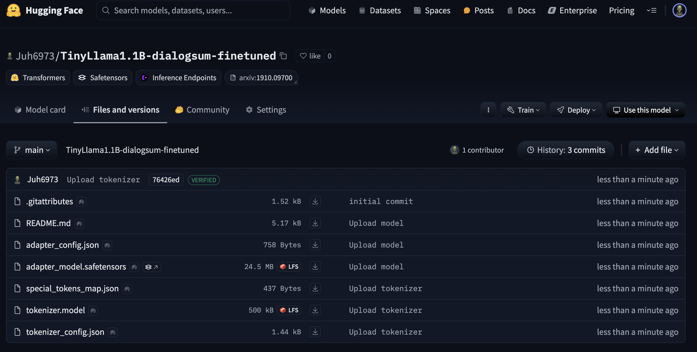

# Technical exercise week 5

## Fixed errors:
- Had to enable internet for `pip install`
- Library version print removed for `rouge`
- Reformated prompt to `formatted_prompt = f"Instruct: Summarize the following conversation.\n{prompt}\nSummary:\n"`
    - Engineered prompt gave better results
- Moved tensors to same device (using "auto" instead of `device_map`)

## Hugging Face
- Model accessible [here](https://huggingface.co/Juh6973/TinyLlama1.1B-dialogsum-finetuned/tree/main)

## Results:
- Samples and results can be found at the end of the notebook.
